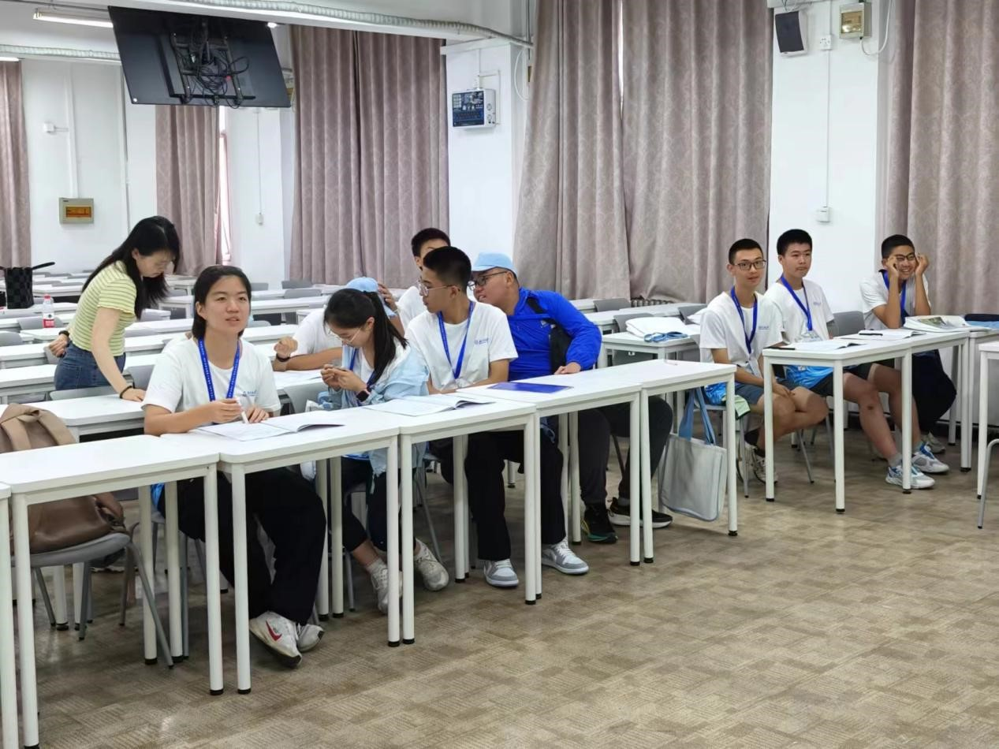

# 个人  
  
- **刘鑫燃**，昌平二中高一，队长，模型设计优化，PPT  
- **胡佩雨**，回龙观中心小学，五年级，讲解员  
- **孙旭东**，北师大附中，初二，笔记整理员  
- **熊怀信**，昌平二中，初一，网页设计员  
- **佟画**，15中南口学校，初二，讲解员

**[访问我们的网站](http://xhslink.com/gLw2qP)**

## 笔记  
  
### AI一组PBL研究笔记  
  
#### 目录  
  
1. **水文学的概念**  
2. **水文学与AI如何结合**  
3. **编程——Python**  
4. **编写模型**  
  
---  
  
### 1. 水文学的概念  
  
- **定义**：研究地球上水的性质、分布、循环、运动变化规律及其与人类社会间相互联系的科学  
- **全球水量**：97.5％为海水，淡水只占2.5％，这2.5％中，可用水只有30％ 

- **重要性**：  
  - **生命之源**：  
    - 新生儿：90％  
    - 少年：80％  
    - 成年：70%  
    - 老年：60％  
    - 将死：50％  
  - **生产之要**：  
    - 生活用水：14.3%  
    - 工业：21%  
    - 农业：61.4%  
    - 生态：3.3%  
- **水的双重性**：资源性＋灾害性  

  - 来自印度洋和太平洋的双重水汽 ——> 南涝北旱 ——> 降水空间不均衡性  
- **水文要素**：  
  - 降水（降雨＆降雪）  
  - 下渗  
  - 蒸发  
  - 径流（地表＆地下）
  
- **我国水资源特点**：  
  - 总量大，人均少  
  - 降水时间分布不匀  
  - 空间分布不匀  
  - 水资源与社会经济要素不匹配  
  - 水生态系统退化严重  
- **南水北调工程**：“四横三纵”（水网）  
  - 四横：海河、黄河、淮河、长江  
  - 三纵：西线、中线、东线工程  
  
---  
  
### 2. 水文学与AI如何结合  
  
- **人工智能 > 机器学习 > 深度学习 ≠ 神经网络**  

  
---  
  
### 3. 编程——Python  
  
- **创始人**：Guido van Rossum  
- **数据类型**：  
  - 整形  
  - 字符型（字符串）  
  - 浮点型  
  - 复合型【列表、元组（不可轻易更改）、字典、张量】  
- **变量**：  
  - 变量名只可包含字母、数字、下划线，不能以数字打头，不能包含空格。  
- **特殊字符**：  
  - `\n`：换行符  
  - `.title()`：首字母大写  
  - `.upper()`：全部转换为大写  
  - `.lower()`：全部转换为小写  
  - `\t`：使文件名中关键词失去作用  
  - `class`：定义对象（类别）  
  - `def __init__`：定义函数  
  - `self`：模型类别，`class`后面紧跟的  
  - `values`：提取数值  
  - `reshape`：数据预处理，归一化  
  
---  
  
### 4. 编写模型  
  
- **过程**：  
  1. 准备数据  
  2. 参数设置  
  3. 初始化模型  
  4. 测试模型并绘图  
- **终端安装包**：  
  - `torch`：模型结构框架  
  - `scikit-learn`：配置模型学习工具  
  - `matplotlib`：计算画图  
  - `tqdm`：进度条显示  
- **机器学习过程**：  
  - 赋值（`c0`＆`h0`）——>迭代（记忆们，更新门，遗忘门） 
 
  
---  
  
## 团队  
  
在学习和探究过程中，我们组的同学都积极完成自己的任务，互相交流，寻找更优的路径和方式。  
  
  
  
  
  
  

---  
  
## 意义（感想）  
  
> 通过这次的项目，我学习到了许多有关于水文学、人工智能、python中基础代码的自主编写以及简单代码的理解。而且还锻炼了我的领导能力、组织能力以及抗压能力。很感谢这几天彭定志教授、古玉学姐和罗群学长的指导和照顾，也感谢我同组9个同学们一直把合作共赢放在第一位，互相学习、共同进步！  
> —— **刘鑫燃**  
  
> 通过这次夏令营，我既看懂了Python，又学会了如何编写Python并让它运行起来。这项技能可以运用到我以后的科技创作当中。特别感谢师兄师姐的引导，感谢校长与家长给予的机会，感谢夏令营提供的平台，也感谢我的伙伴们对我的鼓励。  
> —— **胡佩雨**  
  
> 这次北师大的研学之旅使我有很深的感受。水科学关乎我们的生活，生产。是生命之基，生产之要，生命之源。  
> —— **孙旭东**  
  
> 这次北师大夏令营，令受益匪浅，我不仅学习了编程python，还认识了北师大校园的风光，而最关键的还是我们了解了水，让我对水有了新的认识。  
> —— **熊怀信**  
  
> 感受师范之光    
> 学习AI编程    
> 顺应当代国情    
> 培养青年科学发展  
> —— **佟画**
